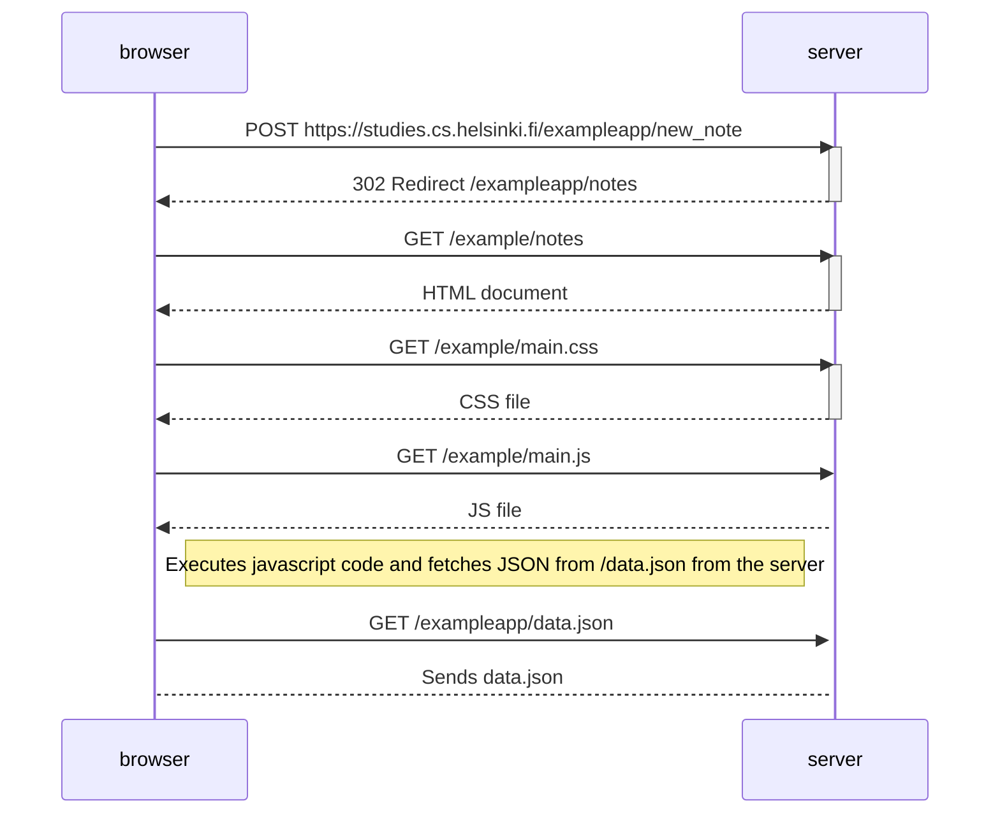

```mermaid
sequenceDiagram
participant browser
participant server

browser ->> server: POST https://studies.cs.helsinki.fi/exampleapp/new_note
activate server
server -->> browser: 302 Redirect /exampleapp/notes
deactivate server

browser ->> server: GET /example/notes
activate server
server -->> browser: HTML document
deactivate server

browser ->> server: GET /example/main.css
activate server
server -->> browser: CSS file
deactivate server

browser ->> server: GET /example/main.js
activate server
server -->> browser:  JS file
Note right of browser: Executes javascript code and fetches JSON from /data.json from the server

browser ->> server: GET /exampleapp/data.json
activate server
server --> browser: Sends data.json

```
