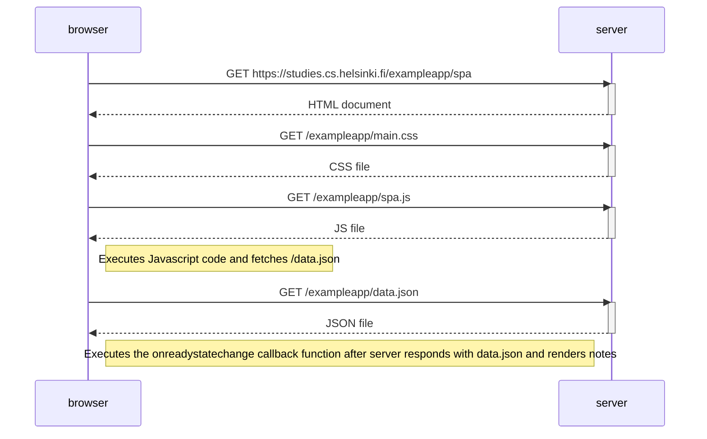

```mermaid
sequenceDiagram
participant browser
participant server

browser ->> server: GET https://studies.cs.helsinki.fi/exampleapp/spa
activate server
server -->> browser: HTML document
deactivate server

browser ->> server: GET /exampleapp/main.css
activate server
server -->> browser: CSS file
deactivate server

browser ->> server: GET /exampleapp/spa.js
activate server
server -->> browser: JS file
deactivate server

Note right of browser: Executes Javascript code and fetches /data.json

browser ->>  server: GET /exampleapp/data.json
activate server
server -->> browser: JSON file
deactivate server

Note right of browser: Executes the onreadystatechange callback function after server responds with data.json and renders notes

```
