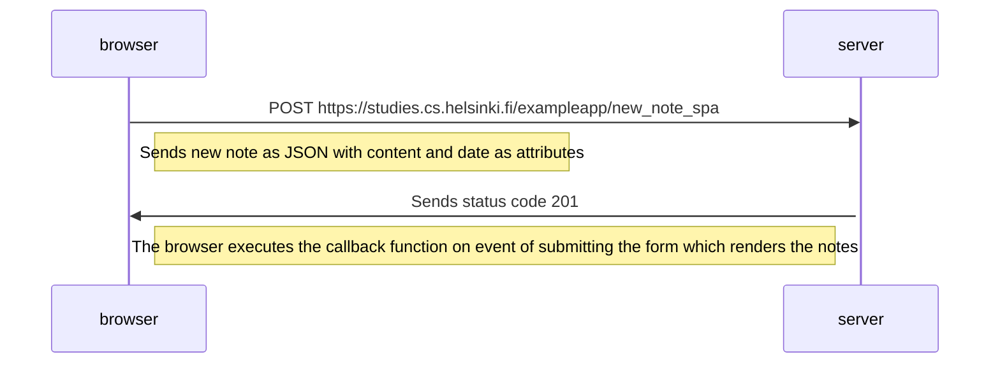

```mermaid
sequenceDiagram
    participant browser
    participant server

    browser->>server: POST https://studies.cs.helsinki.fi/exampleapp/new_note_spa
    Note right of browser: Sends new note as JSON with content and date as attributes
    activate server
    server->>browser: Sends status code 201
    Note right of browser: The browser executes the callback function on event of submitting the form which renders the notes
```
